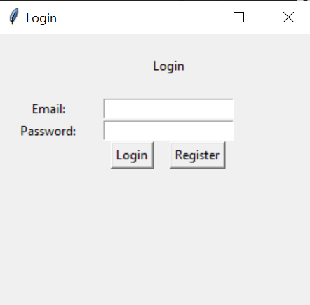
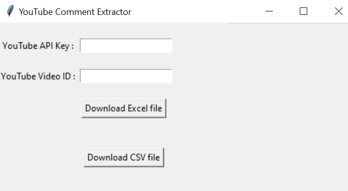
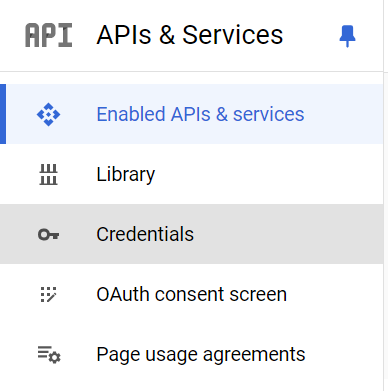
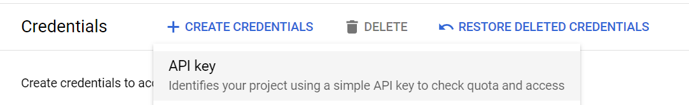

# YouTube Comment Extractor

## Objective

Allow people to extract comments and other important information to conduct further analysis such as sentiment analysis and topic modelling.

## Demonstration

https://www.youtube.com/watch?v=ZpG8ppoPqEI

## Data collect

| Column Name | Data Type    | Description                                           |
|-------------|--------------|-------------------------------------------------------|
| Username    | VARCHAR(256) | The display name of the user who posted the comment.  |
| Comment_ID  | VARCHAR(256) | The ID that YouTube uses to uniquely identify the comment. |
| PublishedAt | DATETIME     | The date and time when the comment was originally published. |
| Like        | INTEGER      | The total number of likes (positive ratings) the comment has received. |
| Comment    | TEXT         | The comment's text.                                   |
| Parent_ID   | VARCHAR(256) | The unique ID of the parent comment. This property is only set if the comment was submitted as a reply to another comment. |

## Database storage

| Column Name | Data Type    | Description                                           |
|-------------|--------------|-------------------------------------------------------|
| email    | VARCHAR(256) | User's email  |
| password  | VARCHAR(256) | User's password, hashed with SHA256 |

## Instruction

### 1. Run the gui.py
  ```
  $ python gui.py
  ```
- A Graphical User Interface (GUI) will show up.


### 2. Login/Register an account



- Email must be in xxx@xxx.com format
- Password must be between 8 and 16 characters long

### 3. Enter YouTube API key and Video ID, click the button to download the excel/csv file for the comments

- Video ID will be the filename
  


## Get API Key
1. Go to Google cloud
2. Search YouTube API
3. Click Enable and then click Manage

4. Click Credentials on the left

5. Click CREATE CREDENTIALS and select API Key


6. The Key is generated ✌️✌️✌️

## Get Video ID

Example: https://www.youtube.com/watch?v=Q4BHRUavpVo

Video ID = Q4BHRUavpVo

## Limitation

* 10000 comments per day


